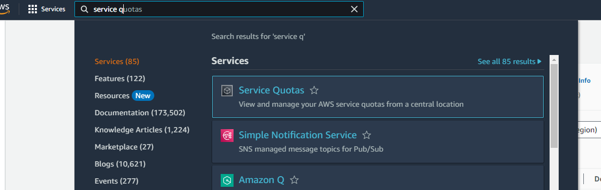
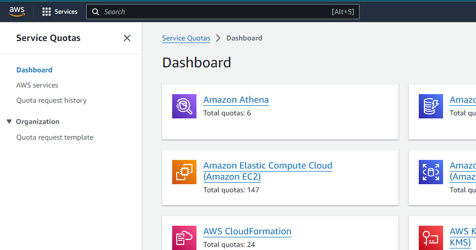
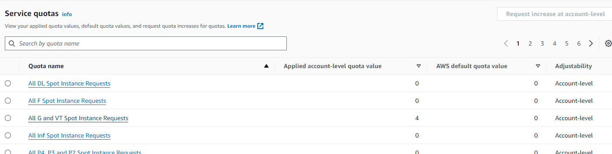
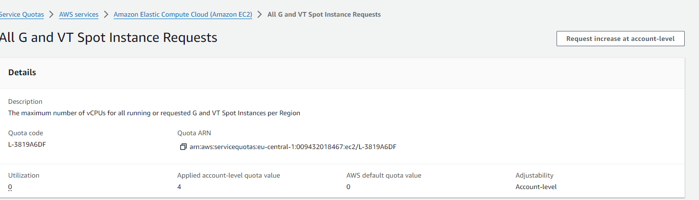
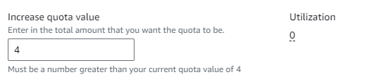
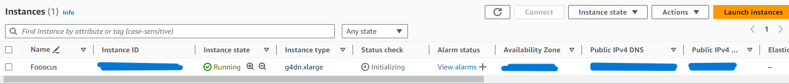
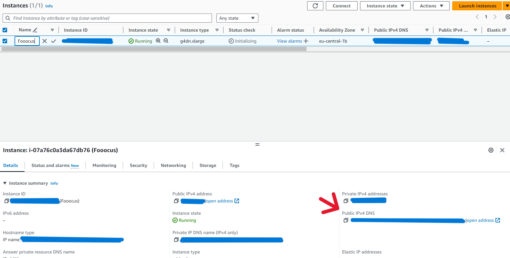
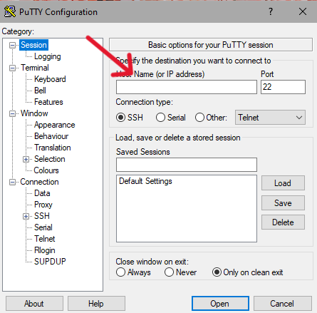
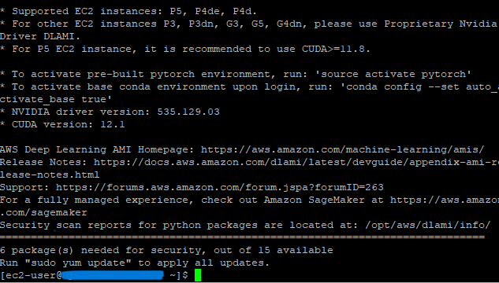
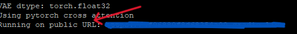

# Running Fooocus (image generation UI) in AWS

---
I used g4 instance with 4 vCpu's. It's the most basic instance with GPU's available. Cost is roughly 0.6 $ per hour.

!!! To use g4 instance you probably have to request a quota increase from 0 to 4 for this type of instance.
To do this, after registering an account and attaching the payment details search for service quotas:



Then in dashboard find Amazon Elastic Compute Cloud:



Then find and click on All G and VT instances



Then click on request increase at account-level 



After that choose 4



Now wait for a while (up to one day). If they decline you can contact support via the link that will come to your email attached to the request. State the adequate use case and they will almost surely approve.

---

# Running an instance with Gradio on AWS

1. Register on AWS (Make sure to add a default payment method in payment preferences)


2. Install PuTTY (SHH client for Windows): https://www.chiark.greenend.org.uk/~sgtatham/putty/latest.html


3. Once you have set up AWS account find EC2 in services:


4. From EC2 dashboard click launch an instance:


5. Name your instance as you wish:


6. In the Amazon Machine Image (AMI) choose the following:


7. In instance type select (g4dn.xlarge)


8. In key pair section click create key pair:


9. Name it as you wish and select rsa and .ppk. Once you click create the download of ppk will begin.


10. Select the key: 


11. If you want to make it secure you can allow only certain IP's to connect to an istance, but to make it simpler I'll
skip this part


12. In the storage section select as much as you need, 128 would be a reasonable choice


13. Then in summary click launch instance:


14. Congratulations! Your instance is running!

15. Now go to the instances tab and click on your instance:



16. Find your public IPv4 DNS:



17. Your instance name to use to connect in PuTTY will be: ec2-user@[your public DNS]


18. Open PuTTY


19. In category tab find Credentials and attach your private key generated in the step 8:


20. Now click on session, paste your instance name (as in step 17) and click open



21. Here click accept:


22. Congratulations! You are connected to your instance:



23. Now run the following commands in terminal one by one:

```
git clone https://github.com/lllyasviel/Fooocus.git
cd Fooocus
pip3 install -r requirements_versions.txt
python3 entry_with_update.py --listen --share
```

24. Now your fooocus instance is publicly running on address indicated in the terminal



