# Running Fooocus (image generation UI) in AWS

1. Register on AWS (Make sure to add a default payment method in payment preferences)

2. Install PuTTY (SHH client for Windows): https://www.chiark.greenend.org.uk/~sgtatham/putty/latest.html

3. Once you have AWS find EC2 in services:

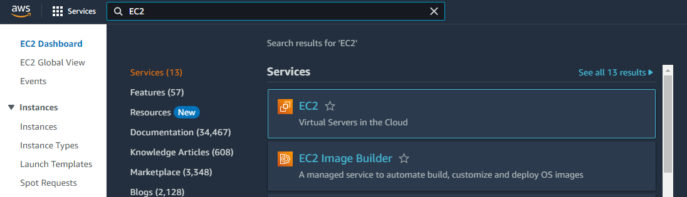

4. From EC2 dashboard click launch an instance:

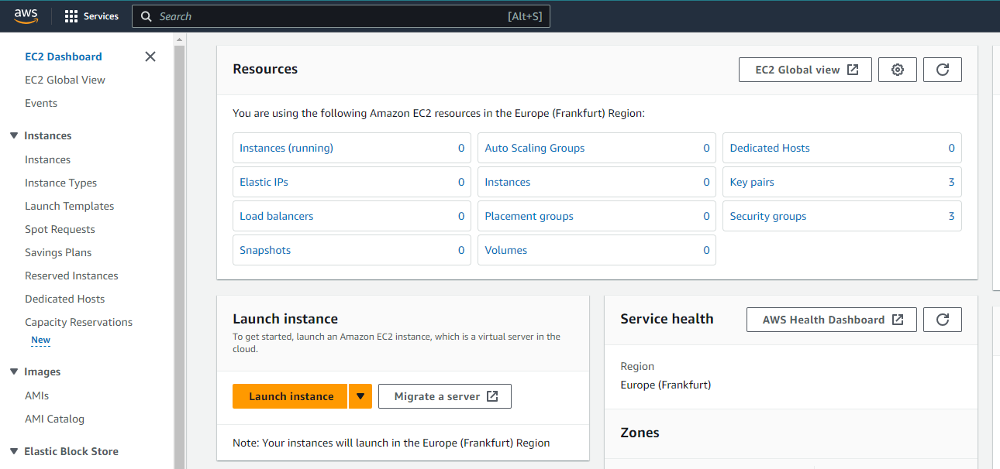

5. Name your instance as you wish:

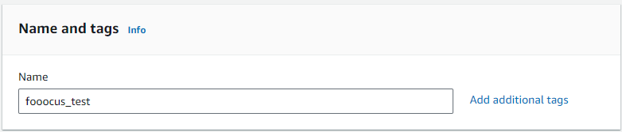

6. In the Amazon Machine Image (AMI) choose the following:

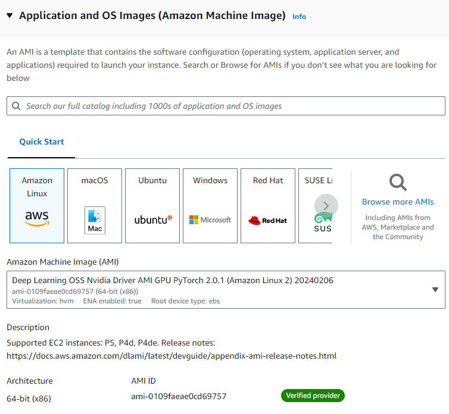

7. In instance type select (g4dn.xlarge)

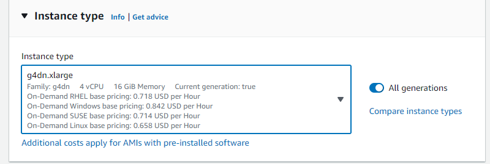

8. In key pair section click create key pair:

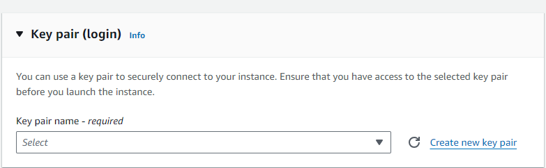

9. Name in as you wish and select rsa and .ppk. Once you click create the download of ppk will begin.

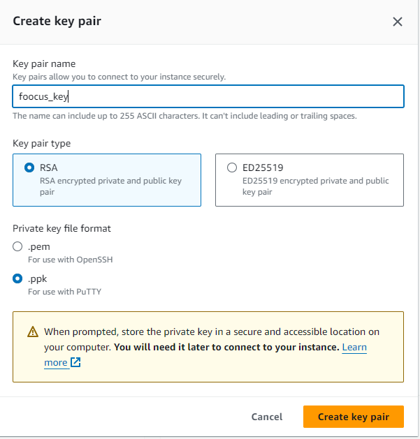

10. Select the key: 

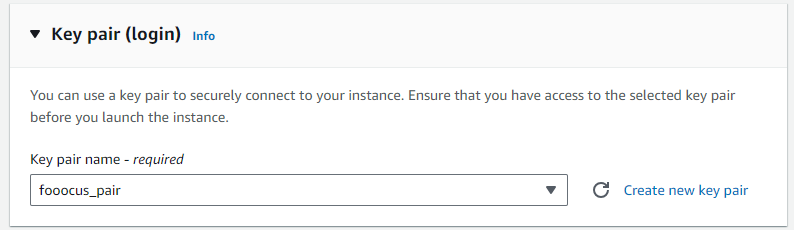

11. If you want to make it secure you can allow only certain IP's to connect to an istance, but to make it simpler I'll
skip this part

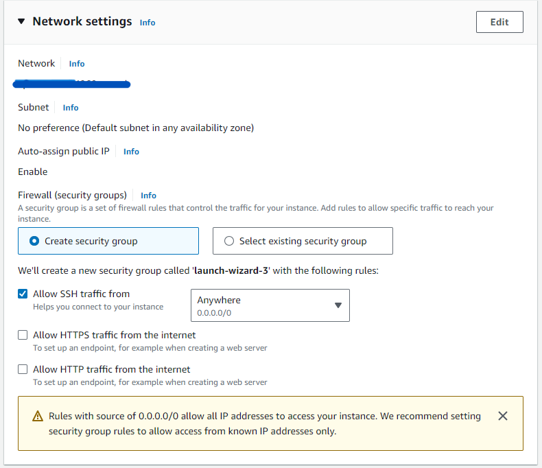

12. In the storage section select as much as you need, 128 would be a reasonable choice

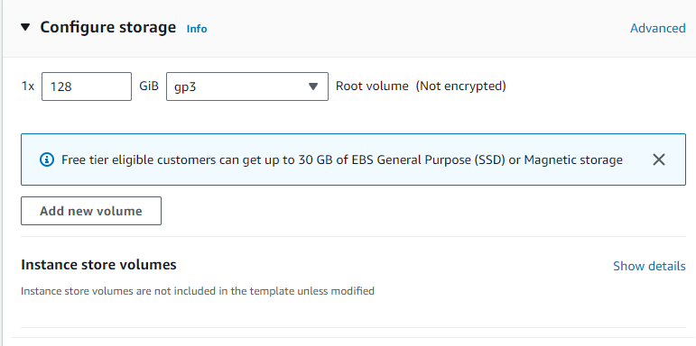

13. Then in summary click launch instance:

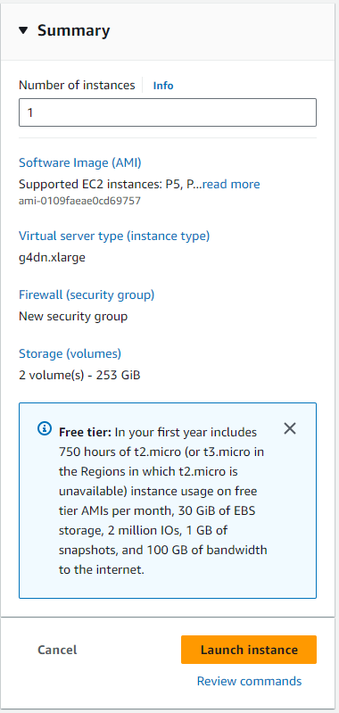

14. Congratulations! Your instance is running!

15. Now go to the instances tab:

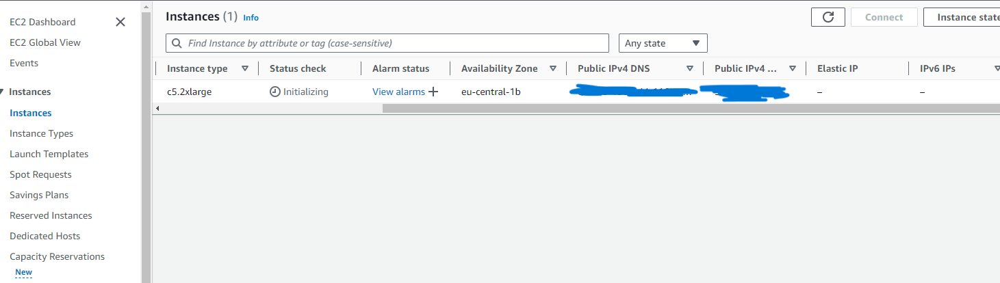
